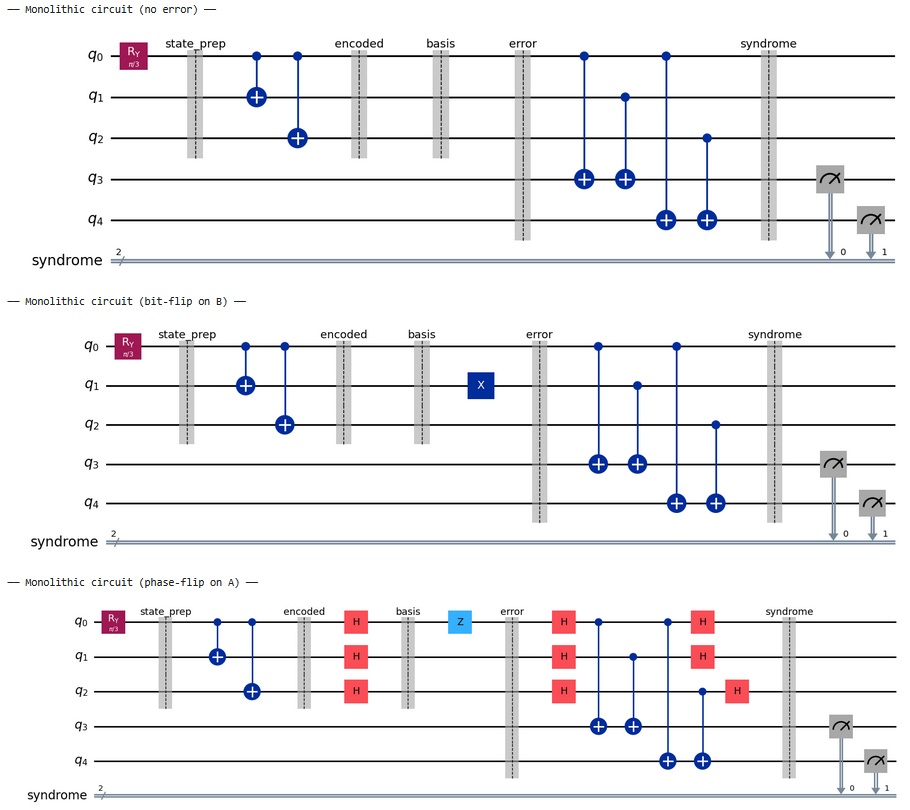
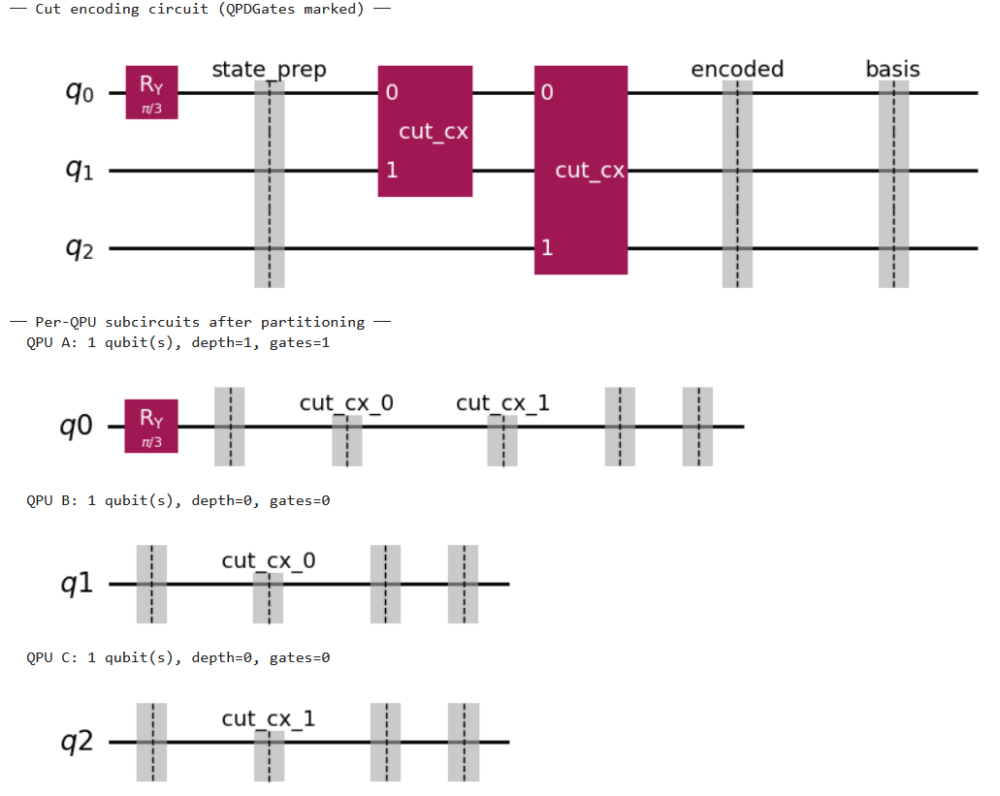
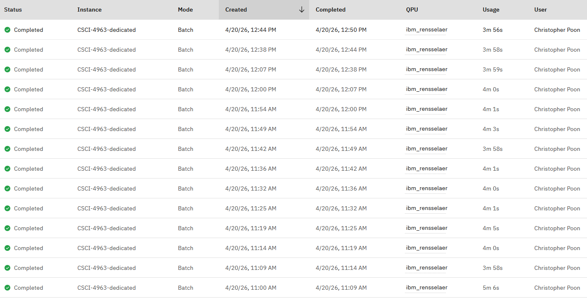
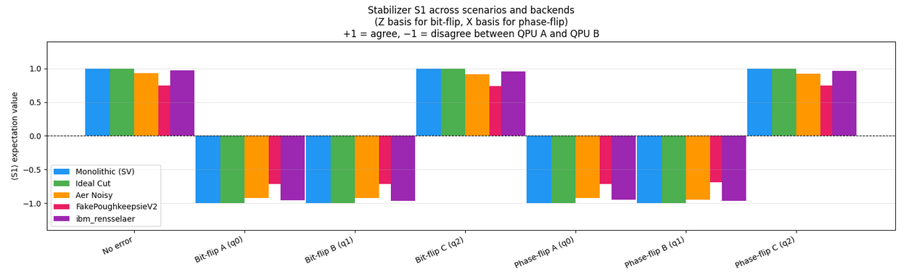

========================================================================================================================
Distributed Quantum Error Correction via Circuit Cutting: Running a 3-Qubit Repetition Code on Real IBM Quantum Hardware
========================================================================================================================
 
*By Christopher Poon*
 
----
 
Introduction
============
 
Quantum computers are currently in the Noisy Intermediate-Scale Quantum (NISQ) era. Unlike classical transistors which flip between 0 and 1 with an error rate around :math:`10^{-27}`, quantum bits (qubits) fail with a probability closer to :math:`10^{-3}-10^{-4}`. This is a fundamental consequence of what makes quantum computing powerful. Qubits exist in superposition, entangle with each other, and interact with their environment. These very properties that make quantum computers useful also make them fragile to external noise, temperature, vibration, etc.
 
As a result, every quantum computation you run accumulates errors. If you run a shallow quantum circuit, less noise is introduced. Run the same kind of deep circuit needed for quantum advantage, such as for Shor's algorithm, the errors will dominate the result. 

The solution is **Quantum Error Correction (QEC)**. Generally, we encode one logical qubit into multiple physical qubits, add redundancy, and use that redundancy to detect and fix errors without ever measuring the data directly. However, the most basic codes, like the 3-qubit repetition code, require 3 physical qubits per logical qubit, reducing the number of qubits you can leverage by 3 per qubit. More sophisticated codes like the surface code require hundreds of physical qubits per logical qubit. IBM's largest chip, IBM Condor, has 1,121 qubits, in which case would have ~100 logical qubits.
 
This is where **Distributed Quantum Computing (DQC)** enters the picture. Instead of scaling monolithic (single) chips, what if you connected many smaller quantum processors together? Each QPU handles a portion of the computation, and the results are combined. However, connecting quantum processors is an ongoing research problem.
 
In this project, I explore the usage of circuit cutting, implemented using IBM's `qiskit-addon-cutting` library, to simulate what distributed quantum error correction would look like and then run it on real IBM Quantum hardware through RPI's IBM Quantum System One.
 
----

Background
==========
 
Quantum Error Correction
------------------------
 
The first practical quantum error correcting code was proposed by Peter Shor in 1995, using 9
physical qubits to protect 1 logical qubit against arbitrary single-qubit errors. Steane and
Laflamme subsequently introduced 7-qubit and 5-qubit codes. The Calderbank-Shor-Steane (CSS)
framework generalized these into a whole family of stabilizer codes.
 
The key insight is that instead of measuring qubit
values directly (which destroys the superposition), you measure the *parity relationships* between
qubits. Two stabilizer operators (:math:`Z\otimes Z` for qubit 1 and 2) tell you whether those qubits agree
(+1) or disagree (-1) without collapsing either one. From the pattern of these syndrome measurements
you can infer which qubit was flipped and correct it.
 
Distributed Quantum Computing
-----------------------------
 
Babaie & Qiao [1]_ (2024) proposed a concrete architecture for distributed QEC. They spread one logical
qubit's three physical qubits across three QPUs (Alice, Bob, Charlie), used pre-shared Bell pairs to
implement the encoding non-locally via quantum teleportation, and performed syndrome extraction
through classical communication. Their key insight is that distributing physical qubits
across separate chips reduces errors same-chip errors.
 
Circuit Cutting
---------------
 
CutQC [2]_ introduced the first framework for hybrid quantum-classical circuit
evaluation by cutting **qubit wires** between gates. The Pauli basis decomposition it uses
is:

:math:`A = \frac{Tr(AI)I + Tr(AX)X + Tr(AY)Y + Tr(AZ)Z}{2}`

giving 4^K overhead for K wire cuts.
 
This project uses the ``qiskit-addon-cutting`` library which implements a similar technique, introduced by Mitarai & Fujii [3]_. Rather than cutting a wire in time, this approach constructs
a virtual two-qubit gate by replacing it with a weighted sum of sampled single-qubit operations. The two-qubit gates are replaced by ``TwoQubitQPDGate`` placeholders that get
expanded into subexperiments by ``generate_cutting_experiments``, with
``reconstruct_expectation_values`` handling the classical reconstruction.
 
----

Problem Description
===================
 
The 3-qubit repetition code encodes one logical qubit as:

:math:`\ket{\psi} = \alpha\ket{0} + \beta\ket{1}  \rightarrow  \alpha\ket{000} + \beta\ket{111}`
 
Two CNOT gates entangle the state from qubit A to qubits B and C. We encode the quantum state this way because the no-cloning theorem forbids copying a quantum state. After encoding, any single bit-flip error changes the state in a detectable way:

:math:`\text{Qubit A flipped: }  \alpha\ket{100} + \beta\ket{011} \rightarrow  \text{ syndrome $11$}`

:math:`\text{Qubit B flipped: }  \alpha\ket{010} + \beta\ket{101} \rightarrow  \text{ syndrome $10$}`

:math:`\text{Qubit C flipped: }  \alpha\ket{001} + \beta\ket{110} \rightarrow  \text{ syndrome $01$}`

:math:`\text{No error: }  \alpha\ket{000} + \beta\ket{111} \rightarrow  \text{ syndrome $00$}`
 
Phase-flip errors are handled by encoding in the X basis instead: :math:`\alpha\ket{+++} + \beta\ket{---}`, where a Z error plays the same role that an X error plays in the computational basis.
 
**The problem** is that the encoding CNOTs that create :math:`\alpha\ket{000} + \beta\ket{111}` are the gates that need to cross QPU boundaries. Qubit A is on QPU Alice, qubit B is on QPU Bob, qubit C is on QPU Charlie. How do you apply CNOT from qubit A to qubit B when A and B are on separate physical machines?
 
Babaie and Qiao [1]_ (2024) use quantum teleportation via Bell pairs. My approach uses circuit cutting and partitioning.

----
 
Method
======
 
Architecture
------------
 
The implementation assigns each data qubit to a separate virtual QPU partition:
 
+--------+--------------------------------+----------------+
| Qubit  | Role                           | QPU partition  |
+========+================================+================+
| q0     | Holds input :math:`\ket{\psi}` | QPU A (Alice)  |
+--------+--------------------------------+----------------+
| q1     | Ancilla copy                   | QPU B (Bob)    |
+--------+--------------------------------+----------------+
| q2     | Ancilla copy                   | QPU C (Charlie)|
+--------+--------------------------------+----------------+
| q3     | Syndrome ancilla S₀            | QPU A          |
+--------+--------------------------------+----------------+
| q4     | Syndrome ancilla S₁            | QPU A          |
+--------+--------------------------------+----------------+
 
The two encoding CNOTs, from q0 to q1 and from q0 to q2, are the cross-QPU gates that get cut.
 
The Full Pipeline
-----------------
The complete distributed QEC loop has 8 steps:
 
1. **Encode**: Apply :math:`Ry(\theta)` to q0, then two encoding CNOTs to produce :math:`\alpha\ket{000} + \beta\ket{111}` or :math:`\alpha\ket{+++} + \beta\ket{---}` for phase-flip mode
2. **Distribute**: ``cut_gates`` replaces the two CNOTs with ``TwoQubitQPDGate`` placeholders;
   ``partition_problem`` splits the circuit into 3 independent subcircuits with one per QPU
3. **Inject error**: An X or Z gate on one qubit simulates a physical error
4. **Execute**: Each QPU runs its subcircuit independently.
5. **Reconstruct**: ``reconstruct_expectation_values`` classically combines the weighted results
   into stabilizer expectation values ``⟨S1⟩`` and ``⟨S2⟩``
6. **Decode**: The sign of each expectation value reveals the syndrome. ``⟨S1⟩ < 0`` means q0
   and q1 disagree; ``⟨S2⟩ < 0`` means q0 and q2 disagree
7. **Correct**: Apply the appropriate X or Z gate to the identified qubit
8. **Verify**: Run the corrected circuit through the cutting pipeline. ``⟨S1⟩`` should return
   to +1.0

----

Implementation Details
======================
 
The project is implemented in Python using:
 
- ``qiskit 2.1.2`` for circuit construction
- ``qiskit-addon-cutting 0.10.0`` for QPD gate cutting and reconstruction
- ``qiskit-aer 0.17.1`` for noisy simulation
- ``qiskit-ibm-runtime 0.40.1`` for hardware execution via ``SamplerV2`` in ``Batch`` mode

----
 
Experimental Results
====================

Monolithic Circuit 
------------------

Cut Circuit
-----------

Statevector Verification
------------------------
 
The first step was confirming that circuit cutting is mathematically exact. Using ``ExactSampler``, which computes exact probability 
distributions without shot noise, the reconstructed expectation values match the direct statevector ground truth:
 
+------------------+-------------+------------+-------------+------------+-----------+
| Scenario         | ⟨ZZI⟩ mono  | ⟨ZZI⟩ cut  | ⟨ZIZ⟩ mono  | ⟨ZIZ⟩ cut  | Max error |
+==================+=============+============+=============+============+===========+
| No error         | +1.000000   | +1.000000  | +1.000000   | +1.000000  | 7.77e-16  |
+------------------+-------------+------------+-------------+------------+-----------+
| Bit-flip A       | -1.000000   | -1.000000  | -1.000000   | -1.000000  | 7.77e-16  |
+------------------+-------------+------------+-------------+------------+-----------+
| Bit-flip B       | -1.000000   | -1.000000  | +1.000000   | +1.000000  | 7.77e-16  |
+------------------+-------------+------------+-------------+------------+-----------+
| Bit-flip C       | +1.000000   | +1.000000  | -1.000000   | -1.000000  | 7.77e-16  |
+------------------+-------------+------------+-------------+------------+-----------+

+--------------------+-------------+------------+-------------+------------+-----------+
| Scenario           | ⟨XXI⟩ mono  | ⟨XXI⟩ cut  | ⟨XIX⟩ mono  | ⟨XIX⟩ cut  | Max error |
+====================+=============+============+=============+============+===========+
| No error           | +1.000000   | +1.000000  | +1.000000   | +1.000000  | 1.22e-15  |
+--------------------+-------------+------------+-------------+------------+-----------+
| Phase-flip A       | -1.000000   | -1.000000  | -1.000000   | -1.000000  | 1.22e-15  |
+--------------------+-------------+------------+-------------+------------+-----------+
| Phase-flip B       | -1.000000   | -1.000000  | +1.000000   | +1.000000  | 1.22e-15  |
+--------------------+-------------+------------+-------------+------------+-----------+
| Phase-flip C       | +1.000000   | +1.000000  | -1.000000   | -1.000000  | 1.22e-15  |
+--------------------+-------------+------------+-------------+------------+-----------+

These stabilizer expectation values are expected. In either case:

No error    :   0.0,   0.0  (No parity)

Bit/Phase-flip on A (q0)    :  -1.0,  -1.0  (A disagrees with B and C)

Bit/Phase-flip on B (q1)    :  -1.0,  +1.0  (only A vs B disagrees)

Bit/Phase-flip on C (q2)    :  +1.0,  -1.0  (only A vs C disagrees)

The max error refers to the difference between the ideal monolithic expected result and the cut expectation value. This verifies
that the cut circuit is correctly implemented.

Noisy Simulator Results
-----------------------

We use the 20-qubit FakePoughkeepsieV2 backend and an Aer noise model mirroring ``ibm_rensselaer`` to
measure how hardware noise degrades the reconstructed stabilizer expectation values.

⟨S1⟩ refers to the parity between qubit 0 and qubit 1. ⟨S2⟩ refers to the parity between qubit 0 and qubit 2.

**FakePoughkeepsieV2 vs Ideal Cut**

+------------------+--------------+-------------+--------------+-------------+----------+-------+
| Scenario         | ⟨S1⟩ ideal   | ⟨S1⟩ fake   | ⟨S2⟩ ideal   | ⟨S2⟩ fake   | Max Δ    | Basis |
+==================+==============+=============+==============+=============+==========+=======+
| No error         | +1.000000    | +0.744516   | +1.000000    | +0.755344   | 2.55e-01 | Z     |
+------------------+--------------+-------------+--------------+-------------+----------+-------+
| Bit-flip A (q0)  | -1.000000    | -0.713095   | -1.000000    | -0.706248   | 2.94e-01 | Z     |
+------------------+--------------+-------------+--------------+-------------+----------+-------+
| Bit-flip B (q1)  | -1.000000    | -0.712740   | +1.000000    | +0.746028   | 2.87e-01 | Z     |
+------------------+--------------+-------------+--------------+-------------+----------+-------+
| Bit-flip C (q2)  | +1.000000    | +0.738378   | -1.000000    | -0.709859   | 2.90e-01 | Z     |
+------------------+--------------+-------------+--------------+-------------+----------+-------+
| Phase-flip A     | -1.000000    | -0.710402   | -1.000000    | -0.701215   | 2.99e-01 | X     |
+------------------+--------------+-------------+--------------+-------------+----------+-------+
| Phase-flip B     | -1.000000    | -0.686935   | +1.000000    | +0.706635   | 3.13e-01 | X     |
+------------------+--------------+-------------+--------------+-------------+----------+-------+
| Phase-flip C     | +1.000000    | +0.744434   | -1.000000    | -0.674490   | 3.26e-01 | X     |
+------------------+--------------+-------------+--------------+-------------+----------+-------+

**Aer noise model (ibm_rensselaer) vs Ideal Cut**

+------------------+--------------+-------------+--------------+-------------+----------+-------+
| Scenario         | ⟨S1⟩ ideal   | ⟨S1⟩ aer    | ⟨S2⟩ ideal   | ⟨S2⟩ aer    | Max Δ    | Basis |
+==================+==============+=============+==============+=============+==========+=======+
| No error         | +1.000000    | +0.934947   | +1.000000    | +0.948445   | 6.51e-02 | Z     |
+------------------+--------------+-------------+--------------+-------------+----------+-------+
| Bit-flip A (q0)  | -1.000000    | -0.925831   | -1.000000    | -0.929753   | 7.42e-02 | Z     |
+------------------+--------------+-------------+--------------+-------------+----------+-------+
| Bit-flip B (q1)  | -1.000000    | -0.923640   | +1.000000    | +0.936664   | 7.64e-02 | Z     |
+------------------+--------------+-------------+--------------+-------------+----------+-------+
| Bit-flip C (q2)  | +1.000000    | +0.918916   | -1.000000    | -0.925124   | 8.11e-02 | Z     |
+------------------+--------------+-------------+--------------+-------------+----------+-------+
| Phase-flip A     | -1.000000    | -0.921927   | -1.000000    | -0.933750   | 7.81e-02 | X     |
+------------------+--------------+-------------+--------------+-------------+----------+-------+
| Phase-flip B     | -1.000000    | -0.949091   | +1.000000    | +0.925608   | 7.44e-02 | X     |
+------------------+--------------+-------------+--------------+-------------+----------+-------+
| Phase-flip C     | +1.000000    | +0.924708   | -1.000000    | -0.937115   | 7.53e-02 | X     |
+------------------+--------------+-------------+--------------+-------------+----------+-------+

Key observations from both simulators:

-  All syndrome signs are maintained under noise in both backends.
- **FakePoughkeepsieV2** noise model is significantly more noisy with ~25–33% errors, due to outdated QPU processor
- **Aer (ibm_rensselaer)** shows less error (~7%), likely due to being an updated ``ibm_eagle`` processor
- The Max Δ column measures how far each noisy value deviates from the ideal ±1.0

----

Error Correction Verification
=============================
 
After decoding the syndrome, the corrective gate is applied and the circuit is re-run. Here, we look only at ⟨S1⟩.
The corrected stabilizer value should return to +1.0:
 
+------------------+---------+-------------+------------+-----------+
| Scenario         | Before  | Ideal after | Fake after | Aer after |
+==================+=========+=============+============+===========+
| No error         | +1.0000 | +1.0000     | +0.7357    | +0.9293   |
+------------------+---------+-------------+------------+-----------+
| Bit-flip A       | -1.0000 | +1.0000     | +0.7331    | +0.9176   |
+------------------+---------+-------------+------------+-----------+
| Bit-flip B       | -1.0000 | +1.0000     | +0.7376    | +0.9349   |
+------------------+---------+-------------+------------+-----------+
| Bit-flip C       | +1.0000 | +1.0000     | +0.7676    | +0.9399   |
+------------------+---------+-------------+------------+-----------+
| Phase-flip A     | -1.0000 | +1.0000     | +0.7262    | +0.9422   |
+------------------+---------+-------------+------------+-----------+
| Phase-flip B     | -1.0000 | +1.0000     | +0.7425    | +0.9160   |
+------------------+---------+-------------+------------+-----------+
| Phase-flip C     | +1.0000 | +1.0000     | +0.7201    | +0.9372   |
+------------------+---------+-------------+------------+-----------+

The correction is simply a gate that flips either the bit or phase. As such, the value should be similar to the previous table's 
results but with opposite signs.

----

Real Hardware: IBM Quantum System One at RPI
============================================

The experiment was executed on ``ibm_rensselaer`` via the dedicated CSCI-4963 allocation at
Rensselaer Polytechnic Institute. 8192 shots per subexperiment, 14 total batches, 3 jobs per batch,
~3-5 minutes per batch for a total runtime of approximately 1 hour 50 minutes.

+------------------+-----------+-----------+-----------+-----------+
| Scenario         | Err ⟨S1⟩  | Err ⟨S2⟩  | Cor ⟨S1⟩  | Cor ⟨S2⟩  |
+==================+===========+===========+===========+===========+
| No error         | +0.9741   | +0.9725   | +0.9670   | +0.9683   |
+------------------+-----------+-----------+-----------+-----------+
| Bit-flip A       | -0.9609   | -0.9582   | +0.9677   | +0.9464   |
+------------------+-----------+-----------+-----------+-----------+
| Bit-flip B       | -0.9660   | +0.9547   | +0.9559   | +0.9495   |
+------------------+-----------+-----------+-----------+-----------+
| Bit-flip C       | +0.9553   | -0.9557   | +0.9460   | +0.9693   |
+------------------+-----------+-----------+-----------+-----------+
| Phase-flip A     | -0.9510   | -0.9547   | +0.9345   | +0.9402   |
+------------------+-----------+-----------+-----------+-----------+
| Phase-flip B     | -0.9613   | +0.9550   | +0.9623   | +0.9609   |
+------------------+-----------+-----------+-----------+-----------+
| Phase-flip C     | +0.9690   | -0.9519   | +0.9447   | +0.9437   |
+------------------+-----------+-----------+-----------+-----------+

All sign patterns matched expectations with minimal error as a result of noise.
 
The most interesting finding was the noise comparison across all our tested backends:

Real hardware outperformed both noise model predictions.

----

Summary
=======

This project demonstrated that circuit cutting is a viable method for simulating quantum error correction. I implemented a
3-qubit repetition code on a partitioned circuit. I then verified it on a Statevector simulator, FakePoughkeepsieV2,
an Aer noise model mimicking ``ibm_rensselaer``, and finally on our very own ``ibm_rensselaer``.

Through this small-scale example of the 3-qubit repetition code, we can gain insight into much larger, effective codes such as Shor's
code or surface codes. Future work would implement these codes to test whether circuit cutting remains practical beyond just 2
cuts.

References
==========

.. [1] Babaie, S. & Qiao, C. (2024). *Towards Distributed Quantum Error Correction for Distributed
   Quantum Computing.* arXiv:2409.05244.
 
.. [2] Tang, W., Tomesh, T., Suchara, M., Larson, J., & Martonosi, M. (2021). *CutQC: Using Small
   Quantum Computers for Large Quantum Circuit Evaluations.* ASPLOS 2021.

.. [3] Mitarai, K. & Fujii, K. (2021). *Constructing a virtual two-qubit gate by
   sampling single-qubit operations.*
 
.. [4] IBM Quantum. *Qiskit Addon: Circuit Cutting Documentation.*
   https://qiskit.github.io/qiskit-addon-cutting
 
.. [5] Sutcliffe, E., Jonnadula, B., Le Gall, C., Moylett, A. E., & Westoby, C. M. (2025).
   *Distributed quantum error correction based on hyperbolic floquet codes.* IEEE QCE 2025.
 
.. [6] Wong, T. G. (2023). *Introduction to Classical and Quantum Computing.*
   https://www.thomaswong.net/introduction-to-classical-and-quantum-computing-1e4p.pdf

----
 
.. note::
 
   Portions of this article were drafted with assistance from Claude (Anthropic). The author takes
   full responsibility for all technical content, experimental results, analysis, and conclusions
   presented.
